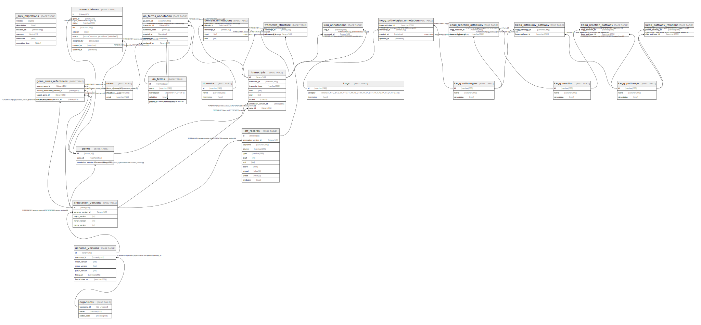

# test

## Tables

| Name | Columns | Comment | Type |
| ---- | ------- | ------- | ---- |
| [_sqlx_migrations](_sqlx_migrations.md) | 6 |  | BASE TABLE |
| [annotation_versions](annotation_versions.md) | 5 |  | BASE TABLE |
| [domain_annotations](domain_annotations.md) | 4 |  | BASE TABLE |
| [domains](domains.md) | 3 |  | BASE TABLE |
| [gene_cross_references](gene_cross_references.md) | 4 |  | BASE TABLE |
| [genes](genes.md) | 3 |  | BASE TABLE |
| [genome_versions](genome_versions.md) | 7 |  | BASE TABLE |
| [gff_records](gff_records.md) | 11 |  | BASE TABLE |
| [go_terms](go_terms.md) | 5 |  | BASE TABLE |
| [go_terms_annotation](go_terms_annotation.md) | 6 |  | BASE TABLE |
| [kegg_orthologies](kegg_orthologies.md) | 3 |  | BASE TABLE |
| [kegg_orthologies_annotation](kegg_orthologies_annotation.md) | 4 |  | BASE TABLE |
| [kegg_orthology_pathway](kegg_orthology_pathway.md) | 2 |  | BASE TABLE |
| [kegg_pathway_relations](kegg_pathway_relations.md) | 2 |  | BASE TABLE |
| [kegg_pathways](kegg_pathways.md) | 3 |  | BASE TABLE |
| [kegg_reaction](kegg_reaction.md) | 3 |  | BASE TABLE |
| [kegg_reaction_orthology](kegg_reaction_orthology.md) | 2 |  | BASE TABLE |
| [kegg_reaction_pathway](kegg_reaction_pathway.md) | 2 |  | BASE TABLE |
| [kog_annotations](kog_annotations.md) | 2 |  | BASE TABLE |
| [kogs](kogs.md) | 3 |  | BASE TABLE |
| [nomenclatures](nomenclatures.md) | 9 |  | BASE TABLE |
| [organisms](organisms.md) | 3 |  | BASE TABLE |
| [transcript_structure](transcript_structure.md) | 2 |  | BASE TABLE |
| [transcripts](transcripts.md) | 8 |  | BASE TABLE |
| [users](users.md) | 3 |  | BASE TABLE |

## Relations

---

> Generated by [tbls](https://github.com/k1LoW/tbls)
