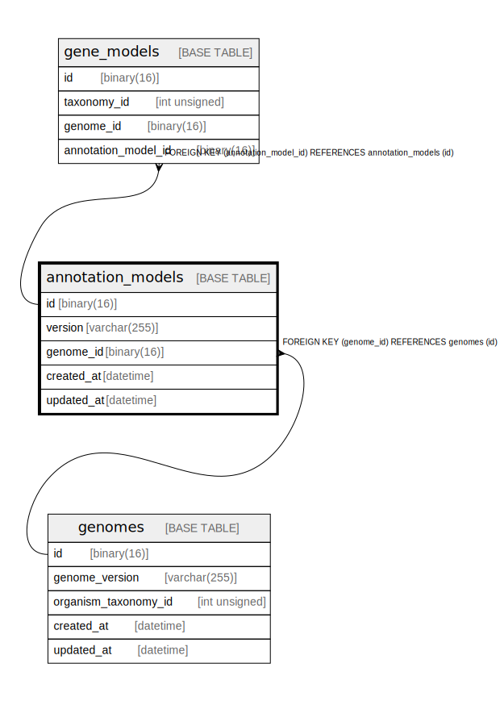

# annotation_models

## Description

<details>
<summary><strong>Table Definition</strong></summary>

```sql
CREATE TABLE `annotation_models` (
  `id` binary(16) NOT NULL DEFAULT (uuid_to_bin(uuid())),
  `version` varchar(255) NOT NULL,
  `genome_id` binary(16) NOT NULL,
  `created_at` datetime DEFAULT CURRENT_TIMESTAMP,
  `updated_at` datetime DEFAULT CURRENT_TIMESTAMP ON UPDATE CURRENT_TIMESTAMP,
  PRIMARY KEY (`id`),
  KEY `genome_id` (`genome_id`),
  CONSTRAINT `annotation_models_ibfk_1` FOREIGN KEY (`genome_id`) REFERENCES `genomes` (`id`)
) ENGINE=InnoDB DEFAULT CHARSET=utf8mb4 COLLATE=utf8mb4_0900_ai_ci
```

</details>

## Columns

| Name | Type | Default | Nullable | Extra Definition | Children | Parents | Comment |
| ---- | ---- | ------- | -------- | ---------------- | -------- | ------- | ------- |
| id | binary(16) | uuid_to_bin(uuid()) | false | DEFAULT_GENERATED | [gene_models](gene_models.md) |  |  |
| version | varchar(255) |  | false |  |  |  |  |
| genome_id | binary(16) |  | false |  |  | [genomes](genomes.md) |  |
| created_at | datetime | CURRENT_TIMESTAMP | true | DEFAULT_GENERATED |  |  |  |
| updated_at | datetime | CURRENT_TIMESTAMP | true | DEFAULT_GENERATED on update CURRENT_TIMESTAMP |  |  |  |

## Constraints

| Name | Type | Definition |
| ---- | ---- | ---------- |
| annotation_models_ibfk_1 | FOREIGN KEY | FOREIGN KEY (genome_id) REFERENCES genomes (id) |
| PRIMARY | PRIMARY KEY | PRIMARY KEY (id) |

## Indexes

| Name | Definition |
| ---- | ---------- |
| genome_id | KEY genome_id (genome_id) USING BTREE |
| PRIMARY | PRIMARY KEY (id) USING BTREE |

## Relations



---

> Generated by [tbls](https://github.com/k1LoW/tbls)
