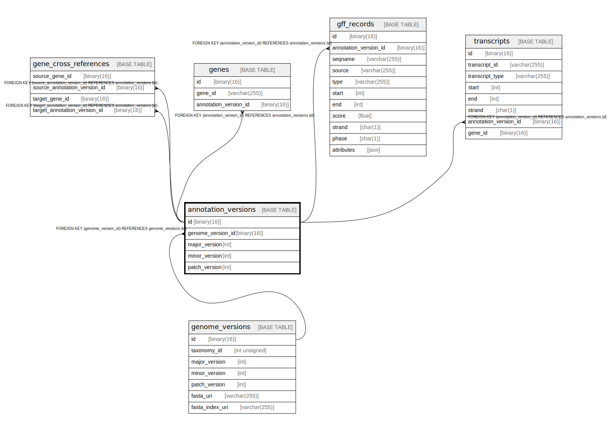

# annotation_versions

## Description

<details>
<summary><strong>Table Definition</strong></summary>

```sql
CREATE TABLE `annotation_versions` (
  `id` binary(16) NOT NULL DEFAULT (uuid_to_bin(uuid())),
  `genome_version_id` binary(16) NOT NULL,
  `major_version` int NOT NULL,
  `minor_version` int NOT NULL,
  `patch_version` int NOT NULL,
  PRIMARY KEY (`id`),
  UNIQUE KEY `genome_version_id` (`genome_version_id`,`major_version`,`minor_version`,`patch_version`),
  CONSTRAINT `annotation_versions_ibfk_1` FOREIGN KEY (`genome_version_id`) REFERENCES `genome_versions` (`id`)
) ENGINE=InnoDB DEFAULT CHARSET=utf8mb4 COLLATE=utf8mb4_0900_ai_ci
```

</details>

## Columns

| Name | Type | Default | Nullable | Extra Definition | Children | Parents | Comment |
| ---- | ---- | ------- | -------- | ---------------- | -------- | ------- | ------- |
| id | binary(16) | uuid_to_bin(uuid()) | false | DEFAULT_GENERATED | [gene_cross_references](gene_cross_references.md) [genes](genes.md) [gff_records](gff_records.md) [transcripts](transcripts.md) |  |  |
| genome_version_id | binary(16) |  | false |  |  | [genome_versions](genome_versions.md) |  |
| major_version | int |  | false |  |  |  |  |
| minor_version | int |  | false |  |  |  |  |
| patch_version | int |  | false |  |  |  |  |

## Constraints

| Name | Type | Definition |
| ---- | ---- | ---------- |
| annotation_versions_ibfk_1 | FOREIGN KEY | FOREIGN KEY (genome_version_id) REFERENCES genome_versions (id) |
| genome_version_id | UNIQUE | UNIQUE KEY genome_version_id (genome_version_id, major_version, minor_version, patch_version) |
| PRIMARY | PRIMARY KEY | PRIMARY KEY (id) |

## Indexes

| Name | Definition |
| ---- | ---------- |
| PRIMARY | PRIMARY KEY (id) USING BTREE |
| genome_version_id | UNIQUE KEY genome_version_id (genome_version_id, major_version, minor_version, patch_version) USING BTREE |

## Relations



---

> Generated by [tbls](https://github.com/k1LoW/tbls)
