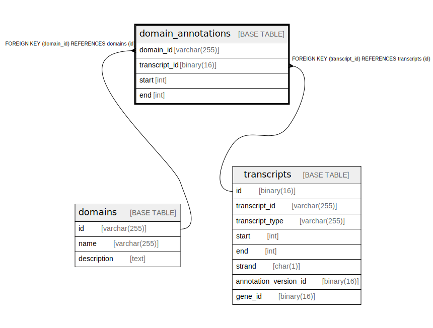

# domain_annotations

## Description

<details>
<summary><strong>Table Definition</strong></summary>

```sql
CREATE TABLE `domain_annotations` (
  `domain_id` varchar(255) NOT NULL,
  `transcript_id` binary(16) NOT NULL,
  `start` int NOT NULL,
  `end` int NOT NULL,
  PRIMARY KEY (`domain_id`,`transcript_id`),
  KEY `transcript_id` (`transcript_id`),
  CONSTRAINT `domain_annotations_ibfk_1` FOREIGN KEY (`domain_id`) REFERENCES `domains` (`id`),
  CONSTRAINT `domain_annotations_ibfk_2` FOREIGN KEY (`transcript_id`) REFERENCES `transcripts` (`id`)
) ENGINE=InnoDB DEFAULT CHARSET=utf8mb4 COLLATE=utf8mb4_0900_ai_ci
```

</details>

## Columns

| Name | Type | Default | Nullable | Children | Parents | Comment |
| ---- | ---- | ------- | -------- | -------- | ------- | ------- |
| domain_id | varchar(255) |  | false |  | [domains](domains.md) |  |
| transcript_id | binary(16) |  | false |  | [transcripts](transcripts.md) |  |
| start | int |  | false |  |  |  |
| end | int |  | false |  |  |  |

## Constraints

| Name | Type | Definition |
| ---- | ---- | ---------- |
| domain_annotations_ibfk_1 | FOREIGN KEY | FOREIGN KEY (domain_id) REFERENCES domains (id) |
| domain_annotations_ibfk_2 | FOREIGN KEY | FOREIGN KEY (transcript_id) REFERENCES transcripts (id) |
| PRIMARY | PRIMARY KEY | PRIMARY KEY (domain_id, transcript_id) |

## Indexes

| Name | Definition |
| ---- | ---------- |
| transcript_id | KEY transcript_id (transcript_id) USING BTREE |
| PRIMARY | PRIMARY KEY (domain_id, transcript_id) USING BTREE |

## Relations



---

> Generated by [tbls](https://github.com/k1LoW/tbls)
