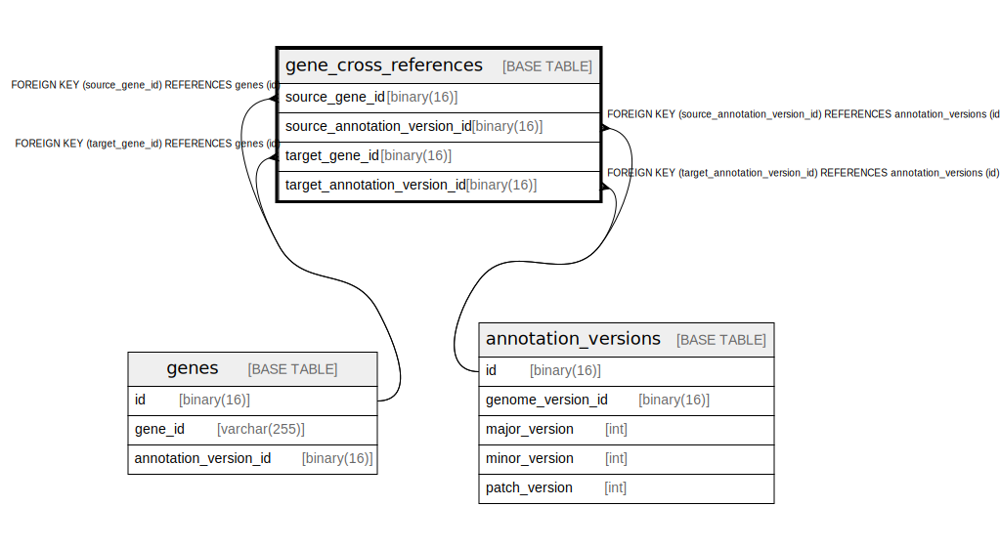

# gene_cross_references

## Description

<details>
<summary><strong>Table Definition</strong></summary>

```sql
CREATE TABLE `gene_cross_references` (
  `source_gene_id` binary(16) NOT NULL,
  `source_annotation_version_id` binary(16) NOT NULL,
  `target_gene_id` binary(16) NOT NULL,
  `target_annotation_version_id` binary(16) NOT NULL,
  PRIMARY KEY (`source_gene_id`,`source_annotation_version_id`,`target_gene_id`,`target_annotation_version_id`),
  KEY `source_annotation_version_id` (`source_annotation_version_id`),
  KEY `target_gene_id` (`target_gene_id`),
  KEY `target_annotation_version_id` (`target_annotation_version_id`),
  CONSTRAINT `gene_cross_references_ibfk_1` FOREIGN KEY (`source_gene_id`) REFERENCES `genes` (`id`),
  CONSTRAINT `gene_cross_references_ibfk_2` FOREIGN KEY (`source_annotation_version_id`) REFERENCES `annotation_versions` (`id`),
  CONSTRAINT `gene_cross_references_ibfk_3` FOREIGN KEY (`target_gene_id`) REFERENCES `genes` (`id`),
  CONSTRAINT `gene_cross_references_ibfk_4` FOREIGN KEY (`target_annotation_version_id`) REFERENCES `annotation_versions` (`id`)
) ENGINE=InnoDB DEFAULT CHARSET=utf8mb4 COLLATE=utf8mb4_0900_ai_ci
```

</details>

## Columns

| Name | Type | Default | Nullable | Children | Parents | Comment |
| ---- | ---- | ------- | -------- | -------- | ------- | ------- |
| source_gene_id | binary(16) |  | false |  | [genes](genes.md) |  |
| source_annotation_version_id | binary(16) |  | false |  | [annotation_versions](annotation_versions.md) |  |
| target_gene_id | binary(16) |  | false |  | [genes](genes.md) |  |
| target_annotation_version_id | binary(16) |  | false |  | [annotation_versions](annotation_versions.md) |  |

## Constraints

| Name | Type | Definition |
| ---- | ---- | ---------- |
| gene_cross_references_ibfk_1 | FOREIGN KEY | FOREIGN KEY (source_gene_id) REFERENCES genes (id) |
| gene_cross_references_ibfk_2 | FOREIGN KEY | FOREIGN KEY (source_annotation_version_id) REFERENCES annotation_versions (id) |
| gene_cross_references_ibfk_3 | FOREIGN KEY | FOREIGN KEY (target_gene_id) REFERENCES genes (id) |
| gene_cross_references_ibfk_4 | FOREIGN KEY | FOREIGN KEY (target_annotation_version_id) REFERENCES annotation_versions (id) |
| PRIMARY | PRIMARY KEY | PRIMARY KEY (source_gene_id, source_annotation_version_id, target_gene_id, target_annotation_version_id) |

## Indexes

| Name | Definition |
| ---- | ---------- |
| source_annotation_version_id | KEY source_annotation_version_id (source_annotation_version_id) USING BTREE |
| target_annotation_version_id | KEY target_annotation_version_id (target_annotation_version_id) USING BTREE |
| target_gene_id | KEY target_gene_id (target_gene_id) USING BTREE |
| PRIMARY | PRIMARY KEY (source_gene_id, source_annotation_version_id, target_gene_id, target_annotation_version_id) USING BTREE |

## Relations



---

> Generated by [tbls](https://github.com/k1LoW/tbls)
