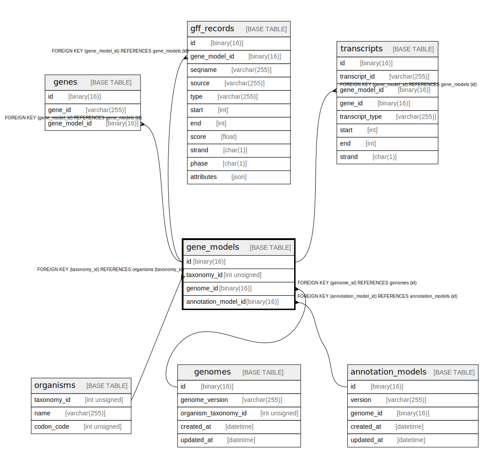

# gene_models

## Description

<details>
<summary><strong>Table Definition</strong></summary>

```sql
CREATE TABLE `gene_models` (
  `id` binary(16) NOT NULL DEFAULT (uuid_to_bin(uuid())),
  `taxonomy_id` int unsigned NOT NULL,
  `genome_id` binary(16) NOT NULL,
  `annotation_model_id` binary(16) NOT NULL,
  PRIMARY KEY (`id`),
  KEY `taxonomy_id` (`taxonomy_id`),
  KEY `genome_id` (`genome_id`),
  KEY `annotation_model_id` (`annotation_model_id`),
  CONSTRAINT `gene_models_ibfk_1` FOREIGN KEY (`taxonomy_id`) REFERENCES `organisms` (`taxonomy_id`),
  CONSTRAINT `gene_models_ibfk_2` FOREIGN KEY (`genome_id`) REFERENCES `genomes` (`id`),
  CONSTRAINT `gene_models_ibfk_3` FOREIGN KEY (`annotation_model_id`) REFERENCES `annotation_models` (`id`)
) ENGINE=InnoDB DEFAULT CHARSET=utf8mb4 COLLATE=utf8mb4_0900_ai_ci
```

</details>

## Columns

| Name                | Type         | Default             | Nullable | Extra Definition  | Children                                                                      | Parents                                   | Comment |
| ------------------- | ------------ | ------------------- | -------- | ----------------- | ----------------------------------------------------------------------------- | ----------------------------------------- | ------- |
| id                  | binary(16)   | uuid_to_bin(uuid()) | false    | DEFAULT_GENERATED | [genes](genes.md) [gff_records](gff_records.md) [transcripts](transcripts.md) |                                           |         |
| taxonomy_id         | int unsigned |                     | false    |                   |                                                                               | [organisms](organisms.md)                 |         |
| genome_id           | binary(16)   |                     | false    |                   |                                                                               | [genomes](genomes.md)                     |         |
| annotation_model_id | binary(16)   |                     | false    |                   |                                                                               | [annotation_models](annotation_models.md) |         |

## Constraints

| Name               | Type        | Definition                                                          |
| ------------------ | ----------- | ------------------------------------------------------------------- |
| gene_models_ibfk_1 | FOREIGN KEY | FOREIGN KEY (taxonomy_id) REFERENCES organisms (taxonomy_id)        |
| gene_models_ibfk_2 | FOREIGN KEY | FOREIGN KEY (genome_id) REFERENCES genomes (id)                     |
| gene_models_ibfk_3 | FOREIGN KEY | FOREIGN KEY (annotation_model_id) REFERENCES annotation_models (id) |
| PRIMARY            | PRIMARY KEY | PRIMARY KEY (id)                                                    |

## Indexes

| Name                | Definition                                                |
| ------------------- | --------------------------------------------------------- |
| annotation_model_id | KEY annotation_model_id (annotation_model_id) USING BTREE |
| genome_id           | KEY genome_id (genome_id) USING BTREE                     |
| taxonomy_id         | KEY taxonomy_id (taxonomy_id) USING BTREE                 |
| PRIMARY             | PRIMARY KEY (id) USING BTREE                              |

## Relations



---

> Generated by [tbls](https://github.com/k1LoW/tbls)
