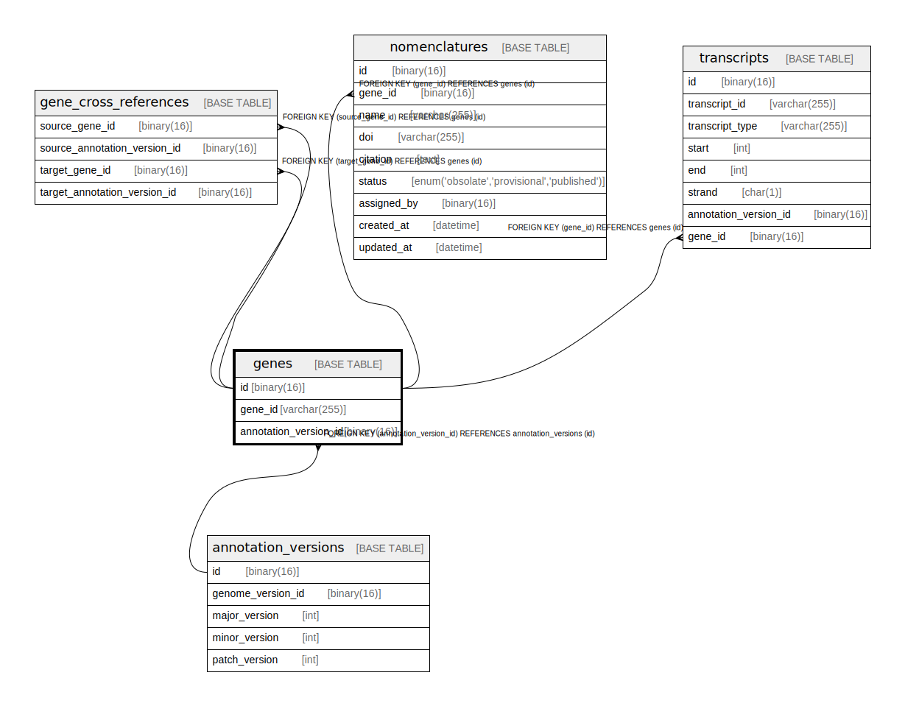

# genes

## Description

<details>
<summary><strong>Table Definition</strong></summary>

```sql
CREATE TABLE `genes` (
  `id` binary(16) NOT NULL DEFAULT (uuid_to_bin(uuid())),
  `gene_id` varchar(255) NOT NULL,
  `gene_model_id` binary(16) NOT NULL,
  PRIMARY KEY (`id`),
  UNIQUE KEY `gene_id` (`gene_id`,`gene_model_id`),
  KEY `gene_model_id` (`gene_model_id`),
  CONSTRAINT `genes_ibfk_1` FOREIGN KEY (`gene_model_id`) REFERENCES `gene_models` (`id`)
) ENGINE=InnoDB DEFAULT CHARSET=utf8mb4 COLLATE=utf8mb4_0900_ai_ci
```

</details>

## Columns

| Name          | Type         | Default             | Nullable | Extra Definition  | Children                      | Parents                       | Comment |
| ------------- | ------------ | ------------------- | -------- | ----------------- | ----------------------------- | ----------------------------- | ------- |
| id            | binary(16)   | uuid_to_bin(uuid()) | false    | DEFAULT_GENERATED | [transcripts](transcripts.md) |                               |         |
| gene_id       | varchar(255) |                     | false    |                   |                               |                               |         |
| gene_model_id | binary(16)   |                     | false    |                   |                               | [gene_models](gene_models.md) |         |

## Constraints

| Name         | Type        | Definition                                              |
| ------------ | ----------- | ------------------------------------------------------- |
| gene_id      | UNIQUE      | UNIQUE KEY gene_id (gene_id, gene_model_id)             |
| genes_ibfk_1 | FOREIGN KEY | FOREIGN KEY (gene_model_id) REFERENCES gene_models (id) |
| PRIMARY      | PRIMARY KEY | PRIMARY KEY (id)                                        |

## Indexes

| Name          | Definition                                              |
| ------------- | ------------------------------------------------------- |
| gene_model_id | KEY gene_model_id (gene_model_id) USING BTREE           |
| PRIMARY       | PRIMARY KEY (id) USING BTREE                            |
| gene_id       | UNIQUE KEY gene_id (gene_id, gene_model_id) USING BTREE |

## Relations



---

> Generated by [tbls](https://github.com/k1LoW/tbls)
