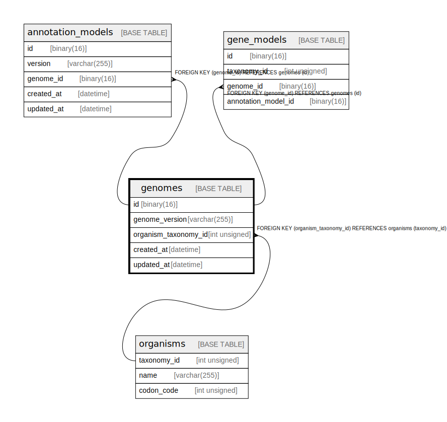

# genomes

## Description

<details>
<summary><strong>Table Definition</strong></summary>

```sql
CREATE TABLE `genomes` (
  `id` binary(16) NOT NULL DEFAULT (uuid_to_bin(uuid())),
  `genome_version` varchar(255) NOT NULL,
  `organism_taxonomy_id` int unsigned NOT NULL,
  `created_at` datetime DEFAULT CURRENT_TIMESTAMP,
  `updated_at` datetime DEFAULT CURRENT_TIMESTAMP ON UPDATE CURRENT_TIMESTAMP,
  PRIMARY KEY (`id`),
  KEY `organism_taxonomy_id` (`organism_taxonomy_id`),
  CONSTRAINT `genomes_ibfk_1` FOREIGN KEY (`organism_taxonomy_id`) REFERENCES `organisms` (`taxonomy_id`)
) ENGINE=InnoDB DEFAULT CHARSET=utf8mb4 COLLATE=utf8mb4_0900_ai_ci
```

</details>

## Columns

| Name | Type | Default | Nullable | Extra Definition | Children | Parents | Comment |
| ---- | ---- | ------- | -------- | ---------------- | -------- | ------- | ------- |
| id | binary(16) | uuid_to_bin(uuid()) | false | DEFAULT_GENERATED | [annotation_models](annotation_models.md) [gene_models](gene_models.md) |  |  |
| genome_version | varchar(255) |  | false |  |  |  |  |
| organism_taxonomy_id | int unsigned |  | false |  |  | [organisms](organisms.md) |  |
| created_at | datetime | CURRENT_TIMESTAMP | true | DEFAULT_GENERATED |  |  |  |
| updated_at | datetime | CURRENT_TIMESTAMP | true | DEFAULT_GENERATED on update CURRENT_TIMESTAMP |  |  |  |

## Constraints

| Name | Type | Definition |
| ---- | ---- | ---------- |
| genomes_ibfk_1 | FOREIGN KEY | FOREIGN KEY (organism_taxonomy_id) REFERENCES organisms (taxonomy_id) |
| PRIMARY | PRIMARY KEY | PRIMARY KEY (id) |

## Indexes

| Name | Definition |
| ---- | ---------- |
| organism_taxonomy_id | KEY organism_taxonomy_id (organism_taxonomy_id) USING BTREE |
| PRIMARY | PRIMARY KEY (id) USING BTREE |

## Relations



---

> Generated by [tbls](https://github.com/k1LoW/tbls)
