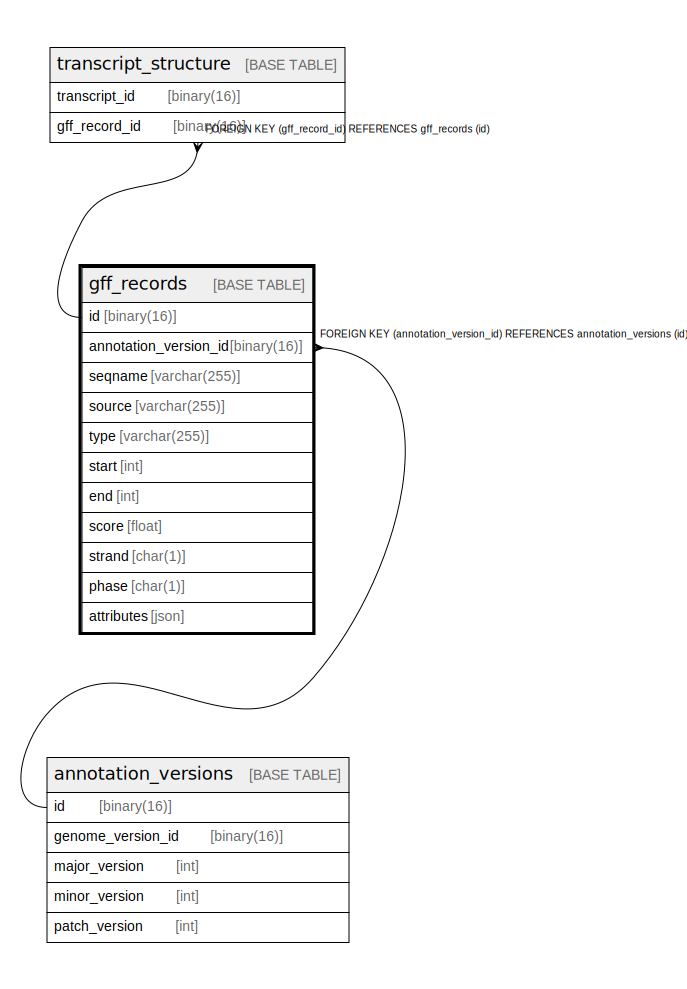

# gff_records

## Description

<details>
<summary><strong>Table Definition</strong></summary>

```sql
CREATE TABLE `gff_records` (
  `id` binary(16) NOT NULL DEFAULT (uuid_to_bin(uuid())),
  `gene_model_id` binary(16) NOT NULL,
  `seqname` varchar(255) NOT NULL,
  `source` varchar(255) NOT NULL,
  `type` varchar(255) NOT NULL,
  `start` int NOT NULL,
  `end` int NOT NULL,
  `score` float NOT NULL,
  `strand` char(1) NOT NULL,
  `phase` char(1) NOT NULL,
  `attributes` json NOT NULL,
  PRIMARY KEY (`id`),
  KEY `gene_model_id` (`gene_model_id`),
  KEY `idx_gff_records_seqname_start_end` (`seqname`,`start`,`end`),
  CONSTRAINT `gff_records_ibfk_1` FOREIGN KEY (`gene_model_id`) REFERENCES `gene_models` (`id`)
) ENGINE=InnoDB DEFAULT CHARSET=utf8mb4 COLLATE=utf8mb4_0900_ai_ci
```

</details>

## Columns

| Name          | Type         | Default             | Nullable | Extra Definition  | Children                                        | Parents                       | Comment |
| ------------- | ------------ | ------------------- | -------- | ----------------- | ----------------------------------------------- | ----------------------------- | ------- |
| id            | binary(16)   | uuid_to_bin(uuid()) | false    | DEFAULT_GENERATED | [transcript_structure](transcript_structure.md) |                               |         |
| gene_model_id | binary(16)   |                     | false    |                   |                                                 | [gene_models](gene_models.md) |         |
| seqname       | varchar(255) |                     | false    |                   |                                                 |                               |         |
| source        | varchar(255) |                     | false    |                   |                                                 |                               |         |
| type          | varchar(255) |                     | false    |                   |                                                 |                               |         |
| start         | int          |                     | false    |                   |                                                 |                               |         |
| end           | int          |                     | false    |                   |                                                 |                               |         |
| score         | float        |                     | false    |                   |                                                 |                               |         |
| strand        | char(1)      |                     | false    |                   |                                                 |                               |         |
| phase         | char(1)      |                     | false    |                   |                                                 |                               |         |
| attributes    | json         |                     | false    |                   |                                                 |                               |         |

## Constraints

| Name               | Type        | Definition                                              |
| ------------------ | ----------- | ------------------------------------------------------- |
| gff_records_ibfk_1 | FOREIGN KEY | FOREIGN KEY (gene_model_id) REFERENCES gene_models (id) |
| PRIMARY            | PRIMARY KEY | PRIMARY KEY (id)                                        |

## Indexes

| Name                              | Definition                                                              |
| --------------------------------- | ----------------------------------------------------------------------- |
| gene_model_id                     | KEY gene_model_id (gene_model_id) USING BTREE                           |
| idx_gff_records_seqname_start_end | KEY idx_gff_records_seqname_start_end (seqname, start, end) USING BTREE |
| PRIMARY                           | PRIMARY KEY (id) USING BTREE                                            |

## Relations



---

> Generated by [tbls](https://github.com/k1LoW/tbls)
