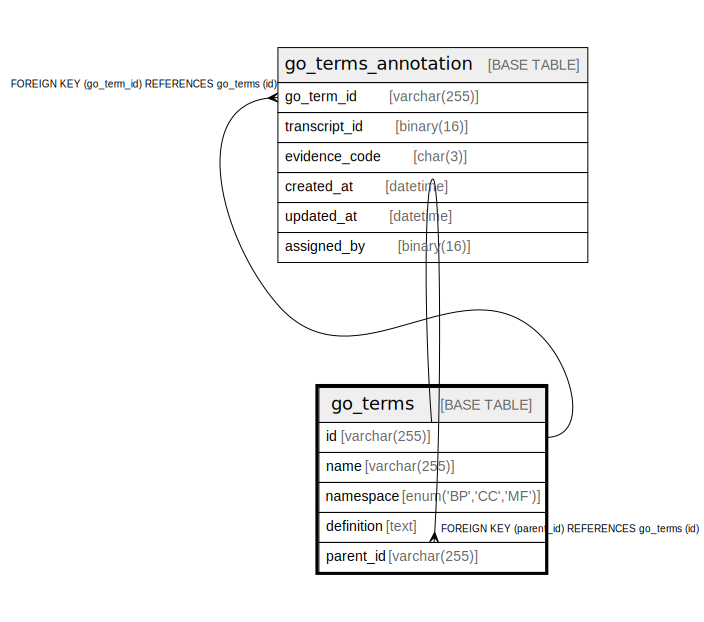

# go_terms

## Description

<details>
<summary><strong>Table Definition</strong></summary>

```sql
CREATE TABLE `go_terms` (
  `id` varchar(255) NOT NULL,
  `name` varchar(255) NOT NULL,
  `namespace` enum('BP','CC','MF') NOT NULL,
  `definition` text NOT NULL,
  `parent_id` varchar(255) DEFAULT NULL,
  PRIMARY KEY (`id`),
  KEY `parent_id` (`parent_id`),
  CONSTRAINT `go_terms_ibfk_1` FOREIGN KEY (`parent_id`) REFERENCES `go_terms` (`id`)
) ENGINE=InnoDB DEFAULT CHARSET=utf8mb4 COLLATE=utf8mb4_0900_ai_ci
```

</details>

## Columns

| Name | Type | Default | Nullable | Children | Parents | Comment |
| ---- | ---- | ------- | -------- | -------- | ------- | ------- |
| id | varchar(255) |  | false | [go_terms](go_terms.md) [go_terms_annotation](go_terms_annotation.md) |  |  |
| name | varchar(255) |  | false |  |  |  |
| namespace | enum('BP','CC','MF') |  | false |  |  |  |
| definition | text |  | false |  |  |  |
| parent_id | varchar(255) |  | true |  | [go_terms](go_terms.md) |  |

## Constraints

| Name | Type | Definition |
| ---- | ---- | ---------- |
| go_terms_ibfk_1 | FOREIGN KEY | FOREIGN KEY (parent_id) REFERENCES go_terms (id) |
| PRIMARY | PRIMARY KEY | PRIMARY KEY (id) |

## Indexes

| Name | Definition |
| ---- | ---------- |
| parent_id | KEY parent_id (parent_id) USING BTREE |
| PRIMARY | PRIMARY KEY (id) USING BTREE |

## Relations



---

> Generated by [tbls](https://github.com/k1LoW/tbls)
