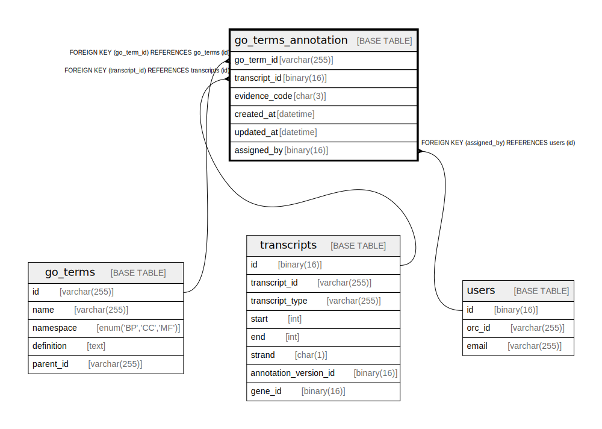

# go_terms_annotation

## Description

<details>
<summary><strong>Table Definition</strong></summary>

```sql
CREATE TABLE `go_terms_annotation` (
  `go_term_id` varchar(255) NOT NULL,
  `transcript_id` binary(16) NOT NULL,
  `evidence_code` char(3) NOT NULL,
  `created_at` datetime DEFAULT CURRENT_TIMESTAMP,
  `updated_at` datetime DEFAULT CURRENT_TIMESTAMP ON UPDATE CURRENT_TIMESTAMP,
  `assisgned_by` binary(16) DEFAULT NULL,
  PRIMARY KEY (`go_term_id`,`transcript_id`),
  KEY `transcript_id` (`transcript_id`),
  KEY `assisgned_by` (`assisgned_by`),
  CONSTRAINT `go_terms_annotation_ibfk_1` FOREIGN KEY (`go_term_id`) REFERENCES `go_terms` (`id`),
  CONSTRAINT `go_terms_annotation_ibfk_2` FOREIGN KEY (`transcript_id`) REFERENCES `transcripts` (`id`),
  CONSTRAINT `go_terms_annotation_ibfk_3` FOREIGN KEY (`assisgned_by`) REFERENCES `users` (`id`)
) ENGINE=InnoDB DEFAULT CHARSET=utf8mb4 COLLATE=utf8mb4_0900_ai_ci
```

</details>

## Columns

| Name | Type | Default | Nullable | Extra Definition | Children | Parents | Comment |
| ---- | ---- | ------- | -------- | ---------------- | -------- | ------- | ------- |
| go_term_id | varchar(255) |  | false |  |  | [go_terms](go_terms.md) |  |
| transcript_id | binary(16) |  | false |  |  | [transcripts](transcripts.md) |  |
| evidence_code | char(3) |  | false |  |  |  |  |
| created_at | datetime | CURRENT_TIMESTAMP | true | DEFAULT_GENERATED |  |  |  |
| updated_at | datetime | CURRENT_TIMESTAMP | true | DEFAULT_GENERATED on update CURRENT_TIMESTAMP |  |  |  |
| assisgned_by | binary(16) |  | true |  |  | [users](users.md) |  |

## Constraints

| Name | Type | Definition |
| ---- | ---- | ---------- |
| go_terms_annotation_ibfk_1 | FOREIGN KEY | FOREIGN KEY (go_term_id) REFERENCES go_terms (id) |
| go_terms_annotation_ibfk_2 | FOREIGN KEY | FOREIGN KEY (transcript_id) REFERENCES transcripts (id) |
| go_terms_annotation_ibfk_3 | FOREIGN KEY | FOREIGN KEY (assisgned_by) REFERENCES users (id) |
| PRIMARY | PRIMARY KEY | PRIMARY KEY (go_term_id, transcript_id) |

## Indexes

| Name | Definition |
| ---- | ---------- |
| assisgned_by | KEY assisgned_by (assisgned_by) USING BTREE |
| transcript_id | KEY transcript_id (transcript_id) USING BTREE |
| PRIMARY | PRIMARY KEY (go_term_id, transcript_id) USING BTREE |

## Relations



---

> Generated by [tbls](https://github.com/k1LoW/tbls)
