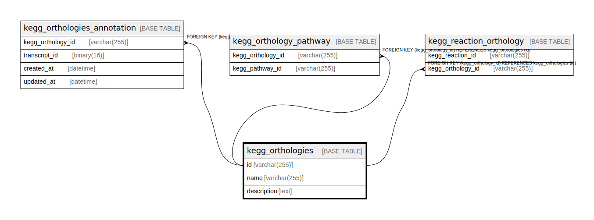

# kegg_orthologies

## Description

<details>
<summary><strong>Table Definition</strong></summary>

```sql
CREATE TABLE `kegg_orthologies` (
  `id` varchar(255) NOT NULL,
  `name` varchar(255) NOT NULL,
  `description` text NOT NULL,
  PRIMARY KEY (`id`)
) ENGINE=InnoDB DEFAULT CHARSET=utf8mb4 COLLATE=utf8mb4_0900_ai_ci
```

</details>

## Columns

| Name | Type | Default | Nullable | Children | Parents | Comment |
| ---- | ---- | ------- | -------- | -------- | ------- | ------- |
| id | varchar(255) |  | false | [kegg_orthologies_annotation](kegg_orthologies_annotation.md) |  |  |
| name | varchar(255) |  | false |  |  |  |
| description | text |  | false |  |  |  |

## Constraints

| Name | Type | Definition |
| ---- | ---- | ---------- |
| PRIMARY | PRIMARY KEY | PRIMARY KEY (id) |

## Indexes

| Name | Definition |
| ---- | ---------- |
| PRIMARY | PRIMARY KEY (id) USING BTREE |

## Relations



---

> Generated by [tbls](https://github.com/k1LoW/tbls)
