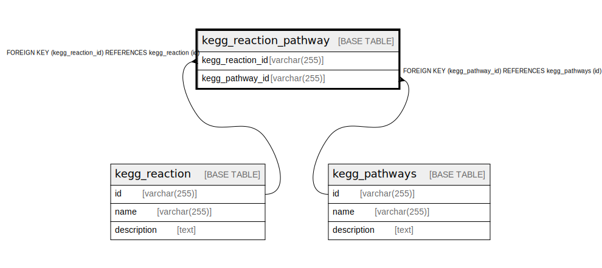

# kegg_reaction_pathway

## Description

<details>
<summary><strong>Table Definition</strong></summary>

```sql
CREATE TABLE `kegg_reaction_pathway` (
  `kegg_reaction_id` varchar(255) NOT NULL,
  `kegg_pathway_id` varchar(255) NOT NULL,
  PRIMARY KEY (`kegg_reaction_id`,`kegg_pathway_id`),
  KEY `kegg_pathway_id` (`kegg_pathway_id`),
  CONSTRAINT `kegg_reaction_pathway_ibfk_1` FOREIGN KEY (`kegg_reaction_id`) REFERENCES `kegg_reaction` (`id`),
  CONSTRAINT `kegg_reaction_pathway_ibfk_2` FOREIGN KEY (`kegg_pathway_id`) REFERENCES `kegg_pathways` (`id`)
) ENGINE=InnoDB DEFAULT CHARSET=utf8mb4 COLLATE=utf8mb4_0900_ai_ci
```

</details>

## Columns

| Name | Type | Default | Nullable | Children | Parents | Comment |
| ---- | ---- | ------- | -------- | -------- | ------- | ------- |
| kegg_reaction_id | varchar(255) |  | false |  | [kegg_reaction](kegg_reaction.md) |  |
| kegg_pathway_id | varchar(255) |  | false |  | [kegg_pathways](kegg_pathways.md) |  |

## Constraints

| Name | Type | Definition |
| ---- | ---- | ---------- |
| kegg_reaction_pathway_ibfk_1 | FOREIGN KEY | FOREIGN KEY (kegg_reaction_id) REFERENCES kegg_reaction (id) |
| kegg_reaction_pathway_ibfk_2 | FOREIGN KEY | FOREIGN KEY (kegg_pathway_id) REFERENCES kegg_pathways (id) |
| PRIMARY | PRIMARY KEY | PRIMARY KEY (kegg_reaction_id, kegg_pathway_id) |

## Indexes

| Name | Definition |
| ---- | ---------- |
| kegg_pathway_id | KEY kegg_pathway_id (kegg_pathway_id) USING BTREE |
| PRIMARY | PRIMARY KEY (kegg_reaction_id, kegg_pathway_id) USING BTREE |

## Relations



---

> Generated by [tbls](https://github.com/k1LoW/tbls)
