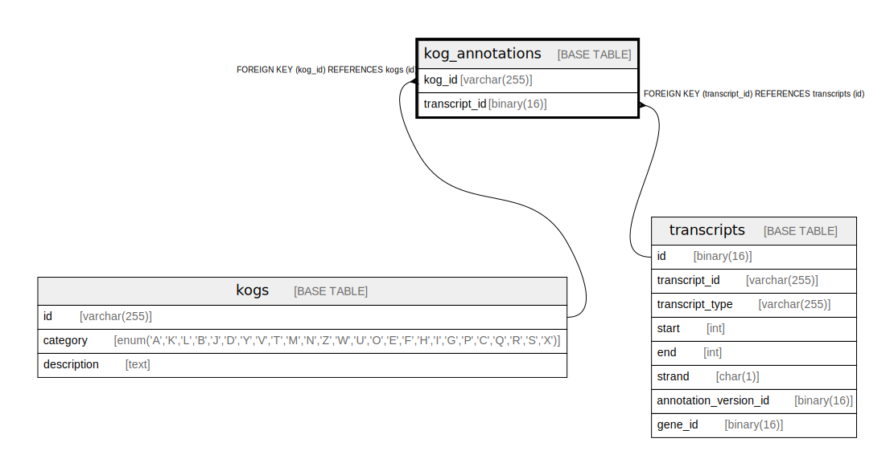

# kog_annotations

## Description

<details>
<summary><strong>Table Definition</strong></summary>

```sql
CREATE TABLE `kog_annotations` (
  `kog_id` varchar(255) NOT NULL,
  `transcript_id` binary(16) NOT NULL,
  PRIMARY KEY (`kog_id`,`transcript_id`),
  KEY `transcript_id` (`transcript_id`),
  CONSTRAINT `kog_annotations_ibfk_1` FOREIGN KEY (`kog_id`) REFERENCES `kogs` (`id`),
  CONSTRAINT `kog_annotations_ibfk_2` FOREIGN KEY (`transcript_id`) REFERENCES `transcripts` (`id`)
) ENGINE=InnoDB DEFAULT CHARSET=utf8mb4 COLLATE=utf8mb4_0900_ai_ci
```

</details>

## Columns

| Name          | Type         | Default | Nullable | Children | Parents                       | Comment |
| ------------- | ------------ | ------- | -------- | -------- | ----------------------------- | ------- |
| kog_id        | varchar(255) |         | false    |          | [kogs](kogs.md)               |         |
| transcript_id | binary(16)   |         | false    |          | [transcripts](transcripts.md) |         |

## Constraints

| Name                   | Type        | Definition                                              |
| ---------------------- | ----------- | ------------------------------------------------------- |
| kog_annotations_ibfk_1 | FOREIGN KEY | FOREIGN KEY (kog_id) REFERENCES kogs (id)               |
| kog_annotations_ibfk_2 | FOREIGN KEY | FOREIGN KEY (transcript_id) REFERENCES transcripts (id) |
| PRIMARY                | PRIMARY KEY | PRIMARY KEY (kog_id, transcript_id)                     |

## Indexes

| Name          | Definition                                      |
| ------------- | ----------------------------------------------- |
| transcript_id | KEY transcript_id (transcript_id) USING BTREE   |
| PRIMARY       | PRIMARY KEY (kog_id, transcript_id) USING BTREE |

## Relations



---

> Generated by [tbls](https://github.com/k1LoW/tbls)
