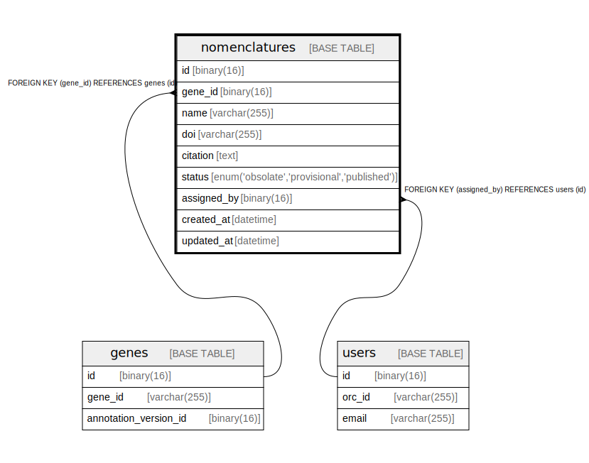

# nomenclatures

## Description

<details>
<summary><strong>Table Definition</strong></summary>

```sql
CREATE TABLE `nomenclatures` (
  `id` binary(16) NOT NULL DEFAULT (uuid_to_bin(uuid())),
  `gene_id` binary(16) NOT NULL,
  `name` varchar(255) NOT NULL,
  `doi` varchar(255) DEFAULT NULL,
  `citation` text,
  `status` enum('obsolate','provisional','published') NOT NULL,
  `assigned_by` binary(16) DEFAULT NULL,
  `created_at` datetime DEFAULT CURRENT_TIMESTAMP,
  `updated_at` datetime DEFAULT CURRENT_TIMESTAMP ON UPDATE CURRENT_TIMESTAMP,
  PRIMARY KEY (`id`),
  KEY `gene_id` (`gene_id`),
  KEY `assigned_by` (`assigned_by`),
  CONSTRAINT `nomenclatures_ibfk_1` FOREIGN KEY (`gene_id`) REFERENCES `genes` (`id`),
  CONSTRAINT `nomenclatures_ibfk_2` FOREIGN KEY (`assigned_by`) REFERENCES `users` (`id`)
) ENGINE=InnoDB DEFAULT CHARSET=utf8mb4 COLLATE=utf8mb4_0900_ai_ci
```

</details>

## Columns

| Name | Type | Default | Nullable | Extra Definition | Children | Parents | Comment |
| ---- | ---- | ------- | -------- | ---------------- | -------- | ------- | ------- |
| id | binary(16) | uuid_to_bin(uuid()) | false | DEFAULT_GENERATED |  |  |  |
| gene_id | binary(16) |  | false |  |  | [genes](genes.md) |  |
| name | varchar(255) |  | false |  |  |  |  |
| doi | varchar(255) |  | true |  |  |  |  |
| citation | text |  | true |  |  |  |  |
| status | enum('obsolate','provisional','published') |  | false |  |  |  |  |
| assigned_by | binary(16) |  | true |  |  | [users](users.md) |  |
| created_at | datetime | CURRENT_TIMESTAMP | true | DEFAULT_GENERATED |  |  |  |
| updated_at | datetime | CURRENT_TIMESTAMP | true | DEFAULT_GENERATED on update CURRENT_TIMESTAMP |  |  |  |

## Constraints

| Name | Type | Definition |
| ---- | ---- | ---------- |
| nomenclatures_ibfk_1 | FOREIGN KEY | FOREIGN KEY (gene_id) REFERENCES genes (id) |
| nomenclatures_ibfk_2 | FOREIGN KEY | FOREIGN KEY (assigned_by) REFERENCES users (id) |
| PRIMARY | PRIMARY KEY | PRIMARY KEY (id) |

## Indexes

| Name | Definition |
| ---- | ---------- |
| assigned_by | KEY assigned_by (assigned_by) USING BTREE |
| gene_id | KEY gene_id (gene_id) USING BTREE |
| PRIMARY | PRIMARY KEY (id) USING BTREE |

## Relations



---

> Generated by [tbls](https://github.com/k1LoW/tbls)
