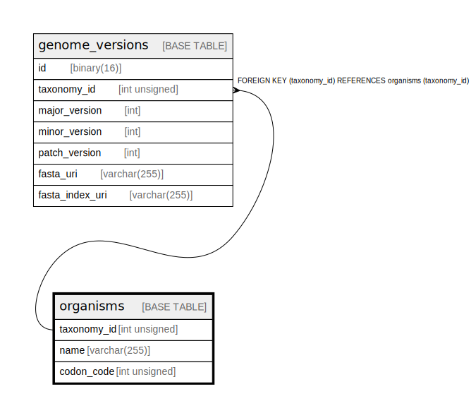

# organisms

## Description

<details>
<summary><strong>Table Definition</strong></summary>

```sql
CREATE TABLE `organisms` (
  `taxonomy_id` int unsigned NOT NULL,
  `name` varchar(255) NOT NULL,
  `codon_code` int unsigned NOT NULL DEFAULT '1',
  PRIMARY KEY (`taxonomy_id`)
) ENGINE=InnoDB DEFAULT CHARSET=utf8mb4 COLLATE=utf8mb4_0900_ai_ci
```

</details>

## Columns

| Name        | Type         | Default | Nullable | Children                                            | Parents | Comment |
| ----------- | ------------ | ------- | -------- | --------------------------------------------------- | ------- | ------- |
| taxonomy_id | int unsigned |         | false    | [gene_models](gene_models.md) [genomes](genomes.md) |         |         |
| name        | varchar(255) |         | false    |                                                     |         |         |
| codon_code  | int unsigned | 1       | false    |                                                     |         |         |

## Constraints

| Name    | Type        | Definition                |
| ------- | ----------- | ------------------------- |
| PRIMARY | PRIMARY KEY | PRIMARY KEY (taxonomy_id) |

## Indexes

| Name    | Definition                            |
| ------- | ------------------------------------- |
| PRIMARY | PRIMARY KEY (taxonomy_id) USING BTREE |

## Relations



---

> Generated by [tbls](https://github.com/k1LoW/tbls)
