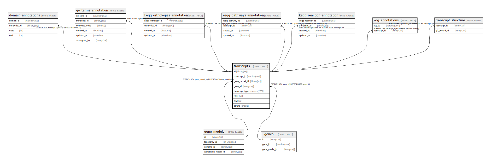

# transcripts

## Description

<details>
<summary><strong>Table Definition</strong></summary>

```sql
CREATE TABLE `transcripts` (
  `id` binary(16) NOT NULL DEFAULT (uuid_to_bin(uuid())),
  `transcript_id` varchar(255) NOT NULL,
  `gene_model_id` binary(16) NOT NULL,
  `gene_id` binary(16) NOT NULL,
  `transcript_type` varchar(255) NOT NULL,
  `start` int NOT NULL,
  `end` int NOT NULL,
  `strand` char(1) NOT NULL,
  PRIMARY KEY (`id`),
  UNIQUE KEY `transcript_id` (`transcript_id`,`gene_model_id`),
  KEY `gene_model_id` (`gene_model_id`),
  KEY `gene_id` (`gene_id`),
  CONSTRAINT `transcripts_ibfk_1` FOREIGN KEY (`gene_model_id`) REFERENCES `gene_models` (`id`),
  CONSTRAINT `transcripts_ibfk_2` FOREIGN KEY (`gene_id`) REFERENCES `genes` (`id`)
) ENGINE=InnoDB DEFAULT CHARSET=utf8mb4 COLLATE=utf8mb4_0900_ai_ci
```

</details>

## Columns

| Name            | Type         | Default             | Nullable | Extra Definition  | Children                                                                                                                                                                                                                                                                                                                                                      | Parents                       | Comment |
| --------------- | ------------ | ------------------- | -------- | ----------------- | ------------------------------------------------------------------------------------------------------------------------------------------------------------------------------------------------------------------------------------------------------------------------------------------------------------------------------------------------------------- | ----------------------------- | ------- |
| id              | binary(16)   | uuid_to_bin(uuid()) | false    | DEFAULT_GENERATED | [domain_annotations](domain_annotations.md) [go_terms_annotation](go_terms_annotation.md) [kegg_orthologies_annotation](kegg_orthologies_annotation.md) [kegg_pathways_annotation](kegg_pathways_annotation.md) [kegg_reaction_annotation](kegg_reaction_annotation.md) [kog_annotations](kog_annotations.md) [transcript_structure](transcript_structure.md) |                               |         |
| transcript_id   | varchar(255) |                     | false    |                   |                                                                                                                                                                                                                                                                                                                                                               |                               |         |
| gene_model_id   | binary(16)   |                     | false    |                   |                                                                                                                                                                                                                                                                                                                                                               | [gene_models](gene_models.md) |         |
| gene_id         | binary(16)   |                     | false    |                   |                                                                                                                                                                                                                                                                                                                                                               | [genes](genes.md)             |         |
| transcript_type | varchar(255) |                     | false    |                   |                                                                                                                                                                                                                                                                                                                                                               |                               |         |
| start           | int          |                     | false    |                   |                                                                                                                                                                                                                                                                                                                                                               |                               |         |
| end             | int          |                     | false    |                   |                                                                                                                                                                                                                                                                                                                                                               |                               |         |
| strand          | char(1)      |                     | false    |                   |                                                                                                                                                                                                                                                                                                                                                               |                               |         |

## Constraints

| Name               | Type        | Definition                                              |
| ------------------ | ----------- | ------------------------------------------------------- |
| PRIMARY            | PRIMARY KEY | PRIMARY KEY (id)                                        |
| transcript_id      | UNIQUE      | UNIQUE KEY transcript_id (transcript_id, gene_model_id) |
| transcripts_ibfk_1 | FOREIGN KEY | FOREIGN KEY (gene_model_id) REFERENCES gene_models (id) |
| transcripts_ibfk_2 | FOREIGN KEY | FOREIGN KEY (gene_id) REFERENCES genes (id)             |

## Indexes

| Name          | Definition                                                          |
| ------------- | ------------------------------------------------------------------- |
| gene_id       | KEY gene_id (gene_id) USING BTREE                                   |
| gene_model_id | KEY gene_model_id (gene_model_id) USING BTREE                       |
| PRIMARY       | PRIMARY KEY (id) USING BTREE                                        |
| transcript_id | UNIQUE KEY transcript_id (transcript_id, gene_model_id) USING BTREE |

## Relations



---

> Generated by [tbls](https://github.com/k1LoW/tbls)
