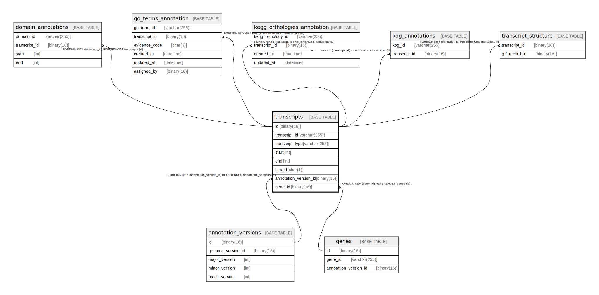

# transcripts

## Description

<details>
<summary><strong>Table Definition</strong></summary>

```sql
CREATE TABLE `transcripts` (
  `id` binary(16) NOT NULL DEFAULT (uuid_to_bin(uuid())),
  `transcript_id` varchar(255) NOT NULL,
  `transcript_type` varchar(255) NOT NULL,
  `start` int NOT NULL,
  `end` int NOT NULL,
  `strand` char(1) NOT NULL,
  `annotation_version_id` binary(16) NOT NULL,
  `gene_id` binary(16) NOT NULL,
  PRIMARY KEY (`id`),
  KEY `annotation_version_id` (`annotation_version_id`),
  KEY `gene_id` (`gene_id`),
  CONSTRAINT `transcripts_ibfk_1` FOREIGN KEY (`annotation_version_id`) REFERENCES `annotation_versions` (`id`),
  CONSTRAINT `transcripts_ibfk_2` FOREIGN KEY (`gene_id`) REFERENCES `genes` (`id`)
) ENGINE=InnoDB DEFAULT CHARSET=utf8mb4 COLLATE=utf8mb4_0900_ai_ci
```

</details>

## Columns

| Name | Type | Default | Nullable | Extra Definition | Children | Parents | Comment |
| ---- | ---- | ------- | -------- | ---------------- | -------- | ------- | ------- |
| id | binary(16) | uuid_to_bin(uuid()) | false | DEFAULT_GENERATED | [domain_annotations](domain_annotations.md) [go_terms_annotation](go_terms_annotation.md) [kegg_orthologies_annotation](kegg_orthologies_annotation.md) [kog_annotations](kog_annotations.md) [transcript_structure](transcript_structure.md) |  |  |
| transcript_id | varchar(255) |  | false |  |  |  |  |
| transcript_type | varchar(255) |  | false |  |  |  |  |
| start | int |  | false |  |  |  |  |
| end | int |  | false |  |  |  |  |
| strand | char(1) |  | false |  |  |  |  |
| annotation_version_id | binary(16) |  | false |  |  | [annotation_versions](annotation_versions.md) |  |
| gene_id | binary(16) |  | false |  |  | [genes](genes.md) |  |

## Constraints

| Name | Type | Definition |
| ---- | ---- | ---------- |
| PRIMARY | PRIMARY KEY | PRIMARY KEY (id) |
| transcripts_ibfk_1 | FOREIGN KEY | FOREIGN KEY (annotation_version_id) REFERENCES annotation_versions (id) |
| transcripts_ibfk_2 | FOREIGN KEY | FOREIGN KEY (gene_id) REFERENCES genes (id) |

## Indexes

| Name | Definition |
| ---- | ---------- |
| annotation_version_id | KEY annotation_version_id (annotation_version_id) USING BTREE |
| gene_id | KEY gene_id (gene_id) USING BTREE |
| PRIMARY | PRIMARY KEY (id) USING BTREE |

## Relations



---

> Generated by [tbls](https://github.com/k1LoW/tbls)
