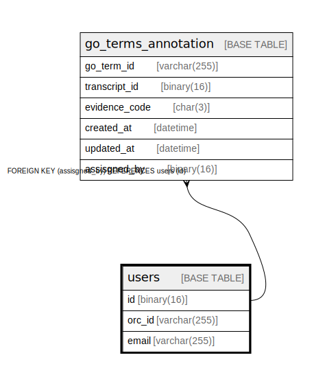

# users

## Description

<details>
<summary><strong>Table Definition</strong></summary>

```sql
CREATE TABLE `users` (
  `id` binary(16) NOT NULL DEFAULT (uuid_to_bin(uuid())),
  `orc_id` varchar(255) NOT NULL,
  `email` varchar(255) NOT NULL,
  PRIMARY KEY (`id`),
  UNIQUE KEY `orc_id` (`orc_id`),
  UNIQUE KEY `email` (`email`)
) ENGINE=InnoDB DEFAULT CHARSET=utf8mb4 COLLATE=utf8mb4_0900_ai_ci
```

</details>

## Columns

| Name | Type | Default | Nullable | Extra Definition | Children | Parents | Comment |
| ---- | ---- | ------- | -------- | ---------------- | -------- | ------- | ------- |
| id | binary(16) | uuid_to_bin(uuid()) | false | DEFAULT_GENERATED | [go_terms_annotation](go_terms_annotation.md) [nomenclatures](nomenclatures.md) |  |  |
| orc_id | varchar(255) |  | false |  |  |  |  |
| email | varchar(255) |  | false |  |  |  |  |

## Constraints

| Name | Type | Definition |
| ---- | ---- | ---------- |
| email | UNIQUE | UNIQUE KEY email (email) |
| orc_id | UNIQUE | UNIQUE KEY orc_id (orc_id) |
| PRIMARY | PRIMARY KEY | PRIMARY KEY (id) |

## Indexes

| Name | Definition |
| ---- | ---------- |
| PRIMARY | PRIMARY KEY (id) USING BTREE |
| email | UNIQUE KEY email (email) USING BTREE |
| orc_id | UNIQUE KEY orc_id (orc_id) USING BTREE |

## Relations



---

> Generated by [tbls](https://github.com/k1LoW/tbls)
